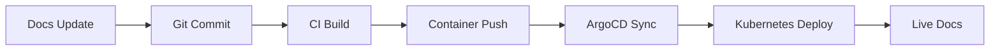

# 📚 MkDocs Documentation System Guide

[](https://www.mkdocs.org/)
[](https://squidfunk.github.io/mkdocs-material/)
[](https://docker.com)
[](https://kubernetes.io)

> **Enterprise Documentation Platform** for the Skynet Platform - Built with MkDocs Material theme, containerized deployment, and
GitOps integration.

## 🎯 Overview

The Skynet Platform uses **MkDocs** with the **Material theme** to provide comprehensive, searchable, and
visually appealing documentation.
The documentation system is:

- 🚀 **Production-ready** with Docker containerization
- 🔄 **GitOps integrated** for automatic deployments
- 📱 **Mobile responsive** with dark/light mode support
- 🔍 **Full-text searchable** with advanced features
- 🎨 **Brand-consistent** with custom theming

## 📁 Project Structure

```
manifests/mkdocs-docs/
├── mkdocs.yml              # Main configuration file
├── Dockerfile              # Multi-stage Docker build
├── deployment.yaml         # Kubernetes deployment manifest
├── nginx.conf             # Production nginx config
└── docs/                  # Documentation source files
    ├── index.md           # Homepage
    ├── architecture/      # Platform architecture docs
    ├── components/        # Component-specific guides
    ├── developer/         # Developer documentation
    └── operations/        # Operations and maintenance
```

## ⚙️ Configuration Overview

### MkDocs Configuration (`mkdocs.yml`)

```yaml
site_name: Skynet Platform Documentation
site_description: Complete GitOps Infrastructure Platform Documentation
site_author: Cyberdine Skynet Team
site_url: https://docu.fle.api64.de

theme:
  name: material
  palette:
    # Light/Dark mode toggle
    - scheme: default
      primary: blue
      accent: cyan
    - scheme: slate
      primary: blue
      accent: cyan

  features:
    - navigation.tabs        # Top-level tabs
    - navigation.sections    # Expandable sections
    - navigation.top         # Back to top button
    - navigation.indexes     # Section index pages
    - search.highlight       # Search result highlighting
    - search.share          # Shareable search URLs
    - content.code.copy     # Copy code button
    - content.code.annotate # Code annotations
```

### Key Features Enabled

| Feature | Description | Benefit |
|---------|-------------|---------|
| **Material Theme** | Modern, responsive design | Professional appearance |
| **Dark/Light Mode** | User preference toggle | Enhanced user experience |
| **Navigation Tabs** | Top-level navigation | Easy section discovery |
| **Code Highlighting** | Syntax highlighting + copy buttons | Developer-friendly |
| **Mermaid Diagrams** | Built-in diagram support | Visual architecture docs |
| **Search** | Full-text search with highlighting | Quick information access |
| **Git Integration** | Automatic revision dates | Content freshness tracking |

## 🚀 Quick Start

### Local Development

1.

**Install MkDocs and Material theme:**

   ```bash
   pip install mkdocs-material
   pip install mkdocs-git-revision-date-localized-plugin
   ```

2.

**Navigate to docs directory:**

   ```bash
   cd manifests/mkdocs-docs
   ```

3.

**Start development server:**

   ```bash
   mkdocs serve
   ```

4.

**Access documentation:**

   ```
   http://localhost:8000
   ```

### Docker Development

1.

**Build container:**

   ```bash
   cd manifests/mkdocs-docs
   docker build -t skynet-docs .
   ```

2.

**Run container:**

   ```bash
   docker run -p 8080:8080 skynet-docs
   ```

3.

**Access documentation:**

   ```
   http://localhost:8080
   ```

## 🏗️ Production Deployment

### Kubernetes Deployment

The documentation is deployed as a Kubernetes service with:

- **2 replicas** for high availability
- **Nginx** serving static files
- **Resource limits** for efficient resource usage
- **Health checks** for reliability

```yaml
# Key deployment specifications
replicas: 2
resources:
  requests:
    memory: "32Mi"
    cpu: "50m"
  limits:
    memory: "128Mi"
    cpu: "200m"
```

### Build Process

The **multi-stage Dockerfile** provides:

1.

**Builder stage**: Uses `squidfunk/mkdocs-material` to build static site
2.
**Production stage**: Uses `nginx:alpine` for efficient serving
3.
**Security**: Non-root user execution
4.
**Optimization**: Minimal attack surface

## 📝 Content Management

### Adding New Pages

1.

**Create markdown file** in appropriate directory:

   ```bash
   # Example: Add new component documentation
   touch docs/components/new-component.md
   ```

2.

**Update navigation** in `mkdocs.yml`:

   ```yaml
   nav:
     - Components:
       - New Component: components/new-component.md
   ```

3.

**Write content** using Markdown with MkDocs extensions

### Supported Content Types

| Type | Extension | Example |
|------|-----------|---------|
| **Code Blocks** | `codehilite` | Syntax highlighting |
| **Admonitions** | `admonition` | Notes, warnings, tips |
| **Tabs** | `pymdownx.tabbed` | Tabbed content sections |
| **Task Lists** | `pymdownx.tasklist` | Interactive checkboxes |
| **Mermaid** | `pymdownx.superfences` | Diagrams and flowcharts |
| **Emojis** | `pymdownx.emoji` | GitHub-style emojis |

### Content Examples

#### Code Block with Annotations

````markdown
```yaml title="Example YAML" hl_lines="2 3"
apiVersion: v1
kind: Service # (1)
metadata:
  name: example # (2)
```

1.
Kubernetes service definition
2.
Service name identifier
````

#### Admonition Boxes

```markdown
!!! tip "Pro Tip"
    Use `mkdocs serve` for live reloading during development.

!!! warning "Important"
    Always test changes in staging before production.
```

#### Tabbed Content

```markdown
=== "Development"
    ```bash
    mkdocs serve
    ```

=== "Production"
    ```bash
    mkdocs build
    ```
```

## 🔄 GitOps Integration

### Automatic Deployment

The documentation follows GitOps principles:

1.

**Source Control**: All docs stored in Git
2.
**CI/CD Pipeline**: Automatic builds on commits
3.
**Container Registry**: Images pushed to GitHub Container Registry
4.
**ArgoCD Sync**: Kubernetes deployment updates automatically

### Deployment Flow



## 📊 Monitoring & Analytics

### Built-in Features

- **Search Analytics**: Track search queries and results
- **Git Revision Dates**: Show content freshness
- **Social Links**: GitHub integration
- **Version Tracking**: Multi-version documentation support

### Performance Optimization

| Optimization | Implementation | Benefit |
|--------------|----------------|---------|
| **Static Generation** | MkDocs build process | Fast loading times |
| **Nginx Serving** | Production web server | Efficient content delivery |
| **Container Caching** | Multi-stage builds | Faster deployments |
| **Resource Limits** | Kubernetes constraints | Predictable performance |

## 🛠️ Automation Integration

### VS Code Integration

Add to `.vscode/tasks.json`:

```json
{
  "label": "MkDocs: Serve Docs",
  "type": "shell",
  "command": "cd manifests/mkdocs-docs && mkdocs serve",
  "group": "build",
  "presentation": {
    "echo": true,
    "reveal": "always",
    "panel": "new"
  },
  "problemMatcher": []
}
```

### Pre-commit Hooks

The automation system includes docs validation:

```bash
# Check documentation quality
./scripts/quick-check.sh

# Auto-fix common issues
./scripts/auto-fix.sh
```

## 🎨 Customization

### Theme Customization

The Material theme supports extensive customization:

- **Colors**: Primary and accent color schemes
- **Fonts**: Typography customization
- **Logo**: Custom branding
- **CSS**: Additional styling
- **JavaScript**: Enhanced functionality

### Plugin Ecosystem

Available plugins for enhanced functionality:

- `mkdocs-git-revision-date-localized-plugin`: Git-based dates
- `mkdocs-minify-plugin`: Asset optimization
- `mkdocs-redirects`: URL redirection management
- `mkdocs-awesome-pages-plugin`: Advanced navigation

## 🚀 Best Practices

### Content Organization

1.

**Logical Structure**: Group related content together
2.
**Clear Navigation**: Use descriptive section names
3.
**Cross-references**: Link between related pages
4.
**Index Pages**: Provide section overviews
5.
**Search Optimization**: Use descriptive headings

### Performance

1.

**Image Optimization**: Compress images appropriately
2.
**Asset Management**: Use CDN for external resources
3.
**Build Optimization**: Minimize build artifacts
4.
**Caching Strategy**: Leverage browser and CDN caching

### Maintenance

1.

**Regular Updates**: Keep dependencies current
2.
**Content Review**: Periodic accuracy checks
3.
**Link Validation**: Check for broken links
4.
**Analytics Review**: Monitor usage patterns

## 🔗 Resources

- [MkDocs Documentation](https://www.mkdocs.org/)
- [Material Theme Guide](https://squidfunk.github.io/mkdocs-material/)
- [Markdown Guide](https://www.markdownguide.org/)
- [Mermaid Diagrams](https://mermaid.js.org/)

---

**Created with ❤️ for the Skynet Platform**
*Enterprise documentation made simple, scalable, and
beautiful.*
