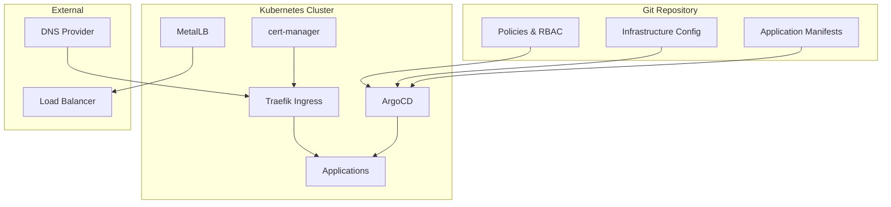

# Architecture Overview

The Skynet Platform is built on modern cloud-native technologies following GitOps principles.

## Core Design Principles

- **Everything as Code**: All infrastructure and application configurations are version controlled
- **GitOps Workflow**: Automated deployments triggered by git commits
- **Security First**: Zero-trust networking and automated security policies
- **Observability**: Comprehensive monitoring, logging, and tracing

## Platform Architecture

## Technology Stack

### Container Platform

- **Kubernetes**: v1.28+ for container orchestration
- **Talos OS**: Immutable and secure Linux distribution for Kubernetes
- **containerd**: Container runtime

### GitOps & Deployment

- **ArgoCD**: Continuous deployment and application lifecycle management
- **Git**: Source of truth for all configurations
- **Helm**: Packaging and templating for Kubernetes applications

### Networking & Security

- **Traefik**: Ingress controller with automatic HTTPS
- **cert-manager**: Automated TLS certificate management (Let's Encrypt)
- **MetalLB**: Load balancer for bare metal Kubernetes clusters

### Monitoring & Observability

- **Prometheus**: Metrics collection and alerting
- **Grafana**: Visualization and dashboards
- **Loki**: Log aggregation
- **Jaeger**: Distributed tracing

## Security Model

The platform implements a comprehensive security model:

- **Network Policies**: Micro-segmentation of network traffic
- **RBAC**: Role-based access control for users and services
- **Pod Security Standards**: Enforced security contexts for all pods
- **Image Security**: Container image scanning and admission control
- **TLS Everywhere**: Encrypted communication between all components

## High Availability

The platform is designed for high availability:

- **Multi-node Setup**: Distributed across multiple nodes
- **Load Balancing**: Traffic distributed across healthy instances
- **Health Checks**: Automatic detection and recovery from failures
- **Data Backup**: Regular backups of critical data and configurations

## Scalability

The platform supports both horizontal and vertical scaling:

- **Horizontal Pod Autoscaler (HPA)**: Automatic pod scaling based on metrics
- **Vertical Pod Autoscaler (VPA)**: Automatic resource allocation adjustment
- **Cluster Autoscaler**: Automatic node scaling based on demand
- **Resource Quotas**: Proper resource allocation and limits
